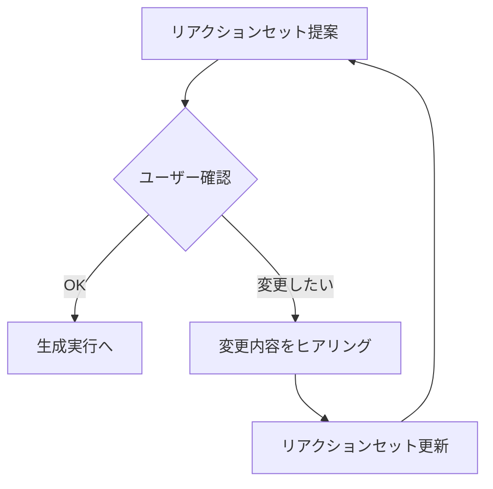

# /linestamp - LINEスタンプ画像生成

## 概要
Vertex AI の gemini-3-pro-image-preview を使用してLINEスタンプ用の画像を生成します。
対話形式でステップバイステップに進行します。

## トリガー
- `/linestamp`
- `/stamp`
- 「スタンプを作って」「スタンプ生成」

---

## ステップバイステップ実行フロー

### Step 1: 参照画像の指定

AskUserQuestion で参照画像のパスを確認：

```
質問: 参照画像（キャラクターの写真やイラスト）のパスを教えてください
例: input/my_character.jpg
```

**確認事項:**
- ファイルが存在するか確認
- 画像形式（JPG, PNG等）を確認
- 存在しない場合は再入力を促す

---

### Step 2: ちびキャラスタイルの選択

AskUserQuestion でスタイルを選択：

| スタイルID | 名前 | 説明 |
|-----------|------|------|
| `standard_sd` | **基本SD** | 約2〜2.5頭身の標準ちびキャラ（推奨） |
| `puni` | **ぷにキャラ型** | 柔らか丸み強調でぷに感 |
| `gacha` | **ガチャ絵型** | ソシャゲ系ガチャ絵風 |
| `ultra_sd` | **超SD** | 約1頭身。丸み重視の超デフォルメ |
| `extreme_chibi` | **極端デフォルメ型** | 約1.5頭身。顔と表情重視 |
| `tall_sd` | **ちょい高SD** | 約3頭身。衣装表現しやすい |
| `mini_chara` | **ミニキャラ風** | 約3〜4頭身。子供寄りでディテール多め |
| `semi_deformed` | **ハーフデフォルメ型** | 約4.5〜5頭身。軽いちび感＋リアル寄り |
| `ball_joint` | **キューポッシュ型** | 球体関節フィギュア風のSD |
| `face_only` | **顔だけタイプ** | 顔だけ強調した極端SD |

```
質問: ちびキャラのスタイルを選んでください
オプション:
- 基本SD（2.5頭身・推奨）
- ぷにキャラ型（丸みぷに感）
- ガチャ絵型（ソシャゲ風）
- 超SD（1頭身・超デフォルメ）
```

**重要**: 選択されたスタイルIDは `--style` オプションで渡す必要がある

---

### Step 3: スタンプ枚数の選択

AskUserQuestion で枚数を選択：

| 選択肢 | 説明 | API呼び出し |
|--------|------|-------------|
| 8枚 | お試し・ミニセット | 1回 |
| 16枚 | 標準セット | 2回 |
| 24枚 | フルセット（推奨） | 2回 |
| 32枚 | 大容量セット | 3回 |
| 40枚 | 最大セット | 4回 |

---

### Step 4: リアクションバリエーションの提案

選択された枚数に応じて、リアクションの組み合わせを提案する。

#### 利用可能なリアクション一覧（40種）

**カテゴリA: 返事・確認系（実用性高）**
| ID | テキスト | 説明 |
|----|----------|------|
| ok | OK! | OKサイン、にっこり |
| ryokai | 了解! | 敬礼ポーズ |
| shochi | 承知しました | お辞儀 |
| mita | 見た! | ウインク＋ピース |
| matte | ちょい待って | ストップジェスチャー |
| wakaranai | わからない | 首かしげ、はてな |
| kangaetoku | 考えとく | 腕組み、目を閉じる |
| muri | 無理 | バツサイン |

**カテゴリB: いいね・称賛系**
| ID | テキスト | 説明 |
|----|----------|------|
| iine | いいね! | サムズアップ |
| tensai | 天才! | 感動のポーズ |
| sugoi | すごい! | 万歳 |
| saikou | 最高! | 両手グッド |
| kakkoi | かっこいい! | キラキラ目 |

**カテゴリC: 感情表現系**
| ID | テキスト | 説明 |
|----|----------|------|
| ureshii | うれしい! | 目がハート |
| kanashii | （涙） | 泣き顔 |
| shocked | （驚） | 目が点 |
| tere | （照） | 頬染め |
| punpun | ぷんぷん | 怒り顔 |
| gaan | ガーン | 青ざめ |
| waku | わくわく | キラキラ目 |

**カテゴリD: 文字なし・表情系**
| ID | テキスト | 説明 |
|----|----------|------|
| mugen | （無） | 虚無の目 |
| jito | （ジト目） | 疑いの眼差し |
| niko | （にこ） | 目を閉じてにっこり |
| doya | （ドヤ） | 得意げ |
| ehe | （えへ） | いたずら笑い |

**カテゴリE: 愛情・親しみ系**
| ID | テキスト | 説明 |
|----|----------|------|
| gyu | ぎゅー | ハグポーズ |
| pekori | ぺこり | お辞儀 |
| suki | 好き | ハートマーク |
| chu | ちゅ | 投げキス |
| yoshi | よしよし | 撫でるポーズ |

**カテゴリF: 様子うかがい系**
| ID | テキスト | 説明 |
|----|----------|------|
| chira | （チラッ） | 壁から覗く |
| seiza | （正座） | 待機の姿勢 |
| sowasowa | そわそわ | 落ち着かない |

**カテゴリG: 丁寧・敬語系（ビジネス向け）**
| ID | テキスト | 説明 |
|----|----------|------|
| onegai | お願いします | 拝むポーズ |
| otsukaresama | お疲れ様です | 会釈 |
| arigatou | ありがとうございます | 深いお辞儀 |
| sumimasen | すみません | 謝罪ポーズ |
| omedeto | おめでとう | クラッカー |

**カテゴリH: 日常アクション系**
| ID | テキスト | 説明 |
|----|----------|------|
| ohayo | おはよう | 朝の挨拶 |
| oyasumi | おやすみ | 眠そう |
| ittekimasu | いってきます | 手を振る |
| tadaima | ただいま | 帰宅 |
| gohan | ごはん | 食事 |

---

### Step 5: リアクション確認ループ（重要）

**ユーザーが「OK」と確定するまで、リアクション確認をループする。**



**確認フロー:**

1. **提案表示**: 選択された枚数に応じたおすすめセットを表示
2. **AskUserQuestion で確認**:
   ```
   質問: このリアクションセットでよろしいですか？
   オプション:
   - OK！これで生成
   - 変更したい
   ```
3. **「変更したい」の場合**:
   - 変更内容をヒアリング（自由入力）
   - generate_stamp.py の REACTIONS リストを更新
   - Step 5 に戻る（ループ）
4. **「OK」の場合**: Step 6 へ進む

**リアクション更新時の注意:**
- generate_stamp.py の `REACTIONS` 配列を直接編集する
- 各リアクションは `{"id": "...", "emotion": "...", "pose": "...", "text": "..."}` 形式
- 枚数に応じて最初のN件が使用される（24枚なら最初の24件）

---

### Step 6: 出力形式の選択

```
質問: 出力形式を選んでください

オプション:
- 申請パッケージ（推奨）: スタンプ + main.png + tab.png + ZIP
- スタンプのみ: スタンプ画像のみ生成
```

---

### Step 7: 生成実行

スキルディレクトリから実行（パスは自動的にカレントディレクトリ基準）：

#### 申請パッケージの場合
```bash
python {SKILL_DIR}/generate_stamp.py --package <画像の絶対パス> --style <スタイルID> --output ./output/linestamp
```

#### スタンプのみの場合
```bash
python {SKILL_DIR}/generate_stamp.py --eco24 <画像の絶対パス> --style <スタイルID> --output ./output/linestamp
```

**コマンドラインオプション:**
| オプション | 説明 | 例 |
|-----------|------|-----|
| `--package` | 申請パッケージ生成 | `--package input/photo.jpg` |
| `--eco24` | 24枚スタンプのみ | `--eco24 input/photo.jpg` |
| `--style` | ちびキャラスタイル | `--style gacha` |
| `--output` | 出力ディレクトリ | `--output ./output/mystamps` |
| `--project` | GCPプロジェクトID | `--project my-project` |
| `--no-items` | アイテム検出をスキップ | `--no-items` |

**スタイルID一覧:**
- `standard_sd` - 基本SD（デフォルト）
- `puni` - ぷにキャラ型
- `gacha` - ガチャ絵型
- `ultra_sd` - 超SD
- `extreme_chibi` - 極端デフォルメ型
- `tall_sd` - ちょい高SD
- `mini_chara` - ミニキャラ風
- `semi_deformed` - ハーフデフォルメ型
- `ball_joint` - キューポッシュ型
- `face_only` - 顔だけタイプ

**注**: `{SKILL_DIR}` はスキルのインストール先（例: `.claude/skills/linestamp`）

---

### Step 8: 結果確認と報告

生成完了後、以下を報告：

1. **生成された画像の一覧**
2. **プレビュー表示**（grid画像をReadツールで表示）
3. **ファイルサイズと仕様適合確認**
4. **次のアクション提案**
   - LINE Creators Marketへの申請手順
   - 再生成オプション
   - 個別スタンプの調整

---

## LINEスタンプ仕様

| 種類 | サイズ | 必須 |
|------|--------|------|
| スタンプ画像 | 最大 370×320px | 8/16/24/32/40枚 |
| メイン画像 | 240×240px | 必須 |
| タブ画像 | 96×74px | 必須 |
| 形式 | PNG（背景透過） | - |

---

## アイテム検出機能

写真に写っているアイテム（花束、ケーキ、プレゼントなど）を自動検出し、リアクションに最適なアイテムを割り当てます。

### 仕組み
1. **アイテム検出**: 写真からアイテムを検出して `_items.json` に保存
2. **マッチング**: 各リアクションに最適なアイテムを自動割り当て
   - 「ありがとう！」→ 花束
   - 「ケーキ！」→ ケーキ
   - 「プレゼント！」→ プレゼント箱
3. **スタンプ生成**: アイテムを持ったキャラクターを生成

### 出力ファイル
- `_items.json`: 検出されたアイテムの一覧
  ```json
  [
    {
      "name": "花束",
      "name_en": "flower bouquet",
      "description": "ピンクと白のバラの花束",
      "description_en": "pink and white rose bouquet",
      "category": "gift",
      "hold_style": "両手で抱える"
    }
  ]
  ```

### 無効化
アイテム検出を無効にする場合は `--no-items` オプションを使用：
```bash
python generate_stamp.py --package input/photo.jpg --no-items
```

---

## 注意事項
- ADC認証が必要: `gcloud auth application-default login`
- Google CloudプロジェクトでVertex AI APIが有効であること
- 生成された画像は `output/` フォルダに保存される

## トラブルシューティング

| エラー | 解決方法 |
|--------|----------|
| 認証エラー | `gcloud auth application-default login` を実行 |
| API未有効 | Google Cloud ConsoleでVertex AI APIを有効化 |
| プロジェクト未指定 | `--project <project-id>` を追加 |
| スタイルが適用されない | `--style` オプションでスタイルIDを明示的に指定 |
